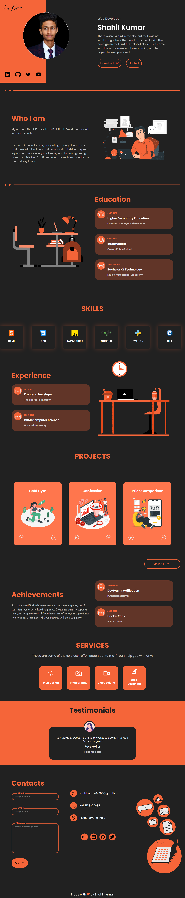

<!-- Improved compatibility of back to top link: See: https://github.com/Shahil9728/Portfolio-Website/ -->

![Contributors][contributors-shield]
![Forks][forks-shield]
![Stargazers][stars-shield]
![Issues][issues-shield]
![MIT License][license-shield]
[![LinkedIn][linkedin-shield]][linkedin-url]

<!-- PROJECT LOGO -->
 

  

  <h3 align="center"><a href="https://shahil9728-portfolio.netlify.app/" target="_blank">Portfolio Website</a></h3>
  

     
     
    <a href="https://github.com/Shahil9728/Portfolio-Website/issues">Report Bug</a>
    ·
    <a href="https://github.com/Shahil9728/Portfolio-Website/issues">Request Feature</a>
  

### Portfolio-Website

### Project Link: [https://shahil9728-portfolio.netlify.app/](https://shahil9728-portfolio.netlify.app/)
Must visit it for better view !🥰 

#A portfolio website of a web developer is a website that showcases the developer's work and skills. It serves as a platform for the developer to display their expertise, experience, and accomplishments to potential clients or employers.

### Built With

This section lists about the languages used in this project .

* 
* 
* 

(<a href="#readme-top">back to top</a>)

<!-- IMAGES -->
## Portfolio Screenshots

 

<!-- CONTACT -->
## Contact

Your Name - [@Shahil9728](https://twitter.com/Shahil9728) - shahilverma91383@gmail.com

Project Link: [https://shahil9728-portfolio.netlify.app/](https://shahil9728-portfolio.netlify.app/)

(<a href="#readme-top">back to top</a>)

<!-- MARKDOWN LINKS & IMAGES -->
<!-- https://www.markdownguide.org/basic-syntax/#reference-style-links -->
[contributors-shield]: https://img.shields.io/github/contributors/othneildrew/Best-README-Template.svg?style=for-the-badge
[forks-shield]: https://img.shields.io/github/forks/othneildrew/Best-README-Template.svg?style=for-the-badge
[stars-shield]: https://img.shields.io/github/stars/othneildrew/Best-README-Template.svg?style=for-the-badge
[issues-shield]: https://img.shields.io/github/issues/othneildrew/Best-README-Template.svg?style=for-the-badge
[license-shield]: https://img.shields.io/github/license/othneildrew/Best-README-Template.svg?style=for-the-badge
[linkedin-shield]: https://img.shields.io/badge/-LinkedIn-black.svg?style=for-the-badge&logo=linkedin&colorB=555
[linkedin-url]: https://www.linkedin.com/in/shahil-kumar-a56246240
[product-screenshot]: images/screenshot.png
[Next.js]: https://img.shields.io/badge/next.js-000000?style=for-the-badge&logo=nextdotjs&logoColor=white
[Next-url]: https://nextjs.org/
[React.js]: https://img.shields.io/badge/React-20232A?style=for-the-badge&logo=react&logoColor=61DAFB
[React-url]: https://reactjs.org/
[Vue.js]: https://img.shields.io/badge/Vue.js-35495E?style=for-the-badge&logo=vuedotjs&logoColor=4FC08D
[Vue-url]: https://vuejs.org/
[Angular.io]: https://img.shields.io/badge/Angular-DD0031?style=for-the-badge&logo=angular&logoColor=white
[Angular-url]: https://angular.io/
[Svelte.dev]: https://img.shields.io/badge/Svelte-4A4A55?style=for-the-badge&logo=svelte&logoColor=FF3E00
[Svelte-url]: https://svelte.dev/
[Laravel.com]: https://img.shields.io/badge/Laravel-FF2D20?style=for-the-badge&logo=laravel&logoColor=white
[Laravel-url]: https://laravel.com
[Bootstrap.com]: https://img.shields.io/badge/Bootstrap-563D7C?style=for-the-badge&logo=bootstrap&logoColor=white
[Bootstrap-url]: https://getbootstrap.com
[JQuery.com]: https://img.shields.io/badge/jQuery-0769AD?style=for-the-badge&logo=jquery&logoColor=white
[JQuery-url]: https://jquery.com 

